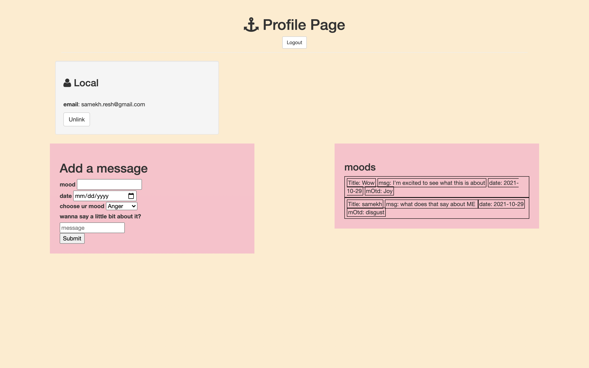

# mood tracker 

**link to project**

### How It’s Made
Node dependencies, express.js framework, pjs files, passport

<b>Langs used</b>
Using Express.js, Node.js, Javascript, HTML5, CSS3,

### optimizations

Css could be better
I want to make a feature where, based on the mood that is sent entered, it changes the styling of that element that displays the mood. 

Another section is a page which has all the moods separated, so you can see how many good days and bad days. 

In the future, what I would love to do is have an analytic approach to it, so that you can see what are the types of words you used, looking at if there are certain verbs or synonyms circling around, any issues. 

Maybe a function that can highlight a part of the screen so you can enter highlight the necessary information that is pertinent to why that day had that mood. 

Analytics for the amount of good or bad days you have. 

Could be useful for psychiatrists to keep a track of?

### Lessons Learned

How to do a put request and manipulate the information into the dom. 

